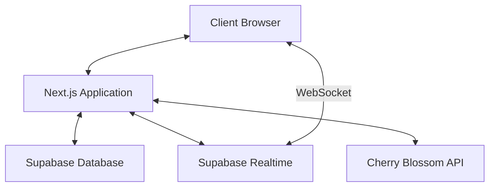
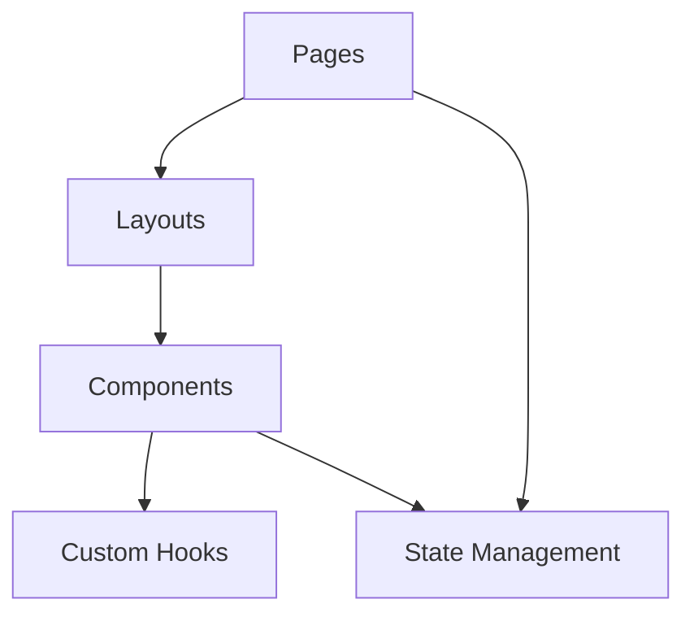
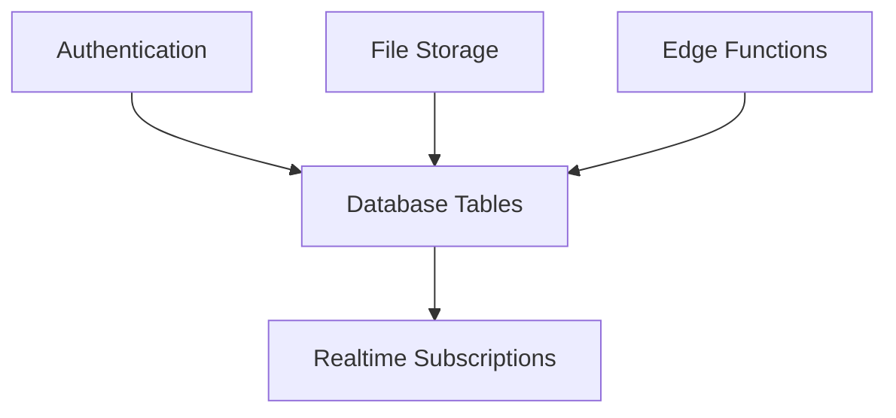
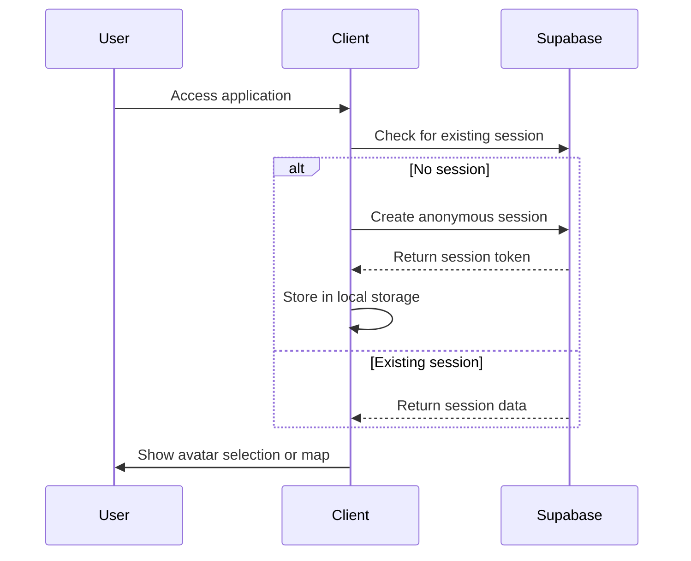
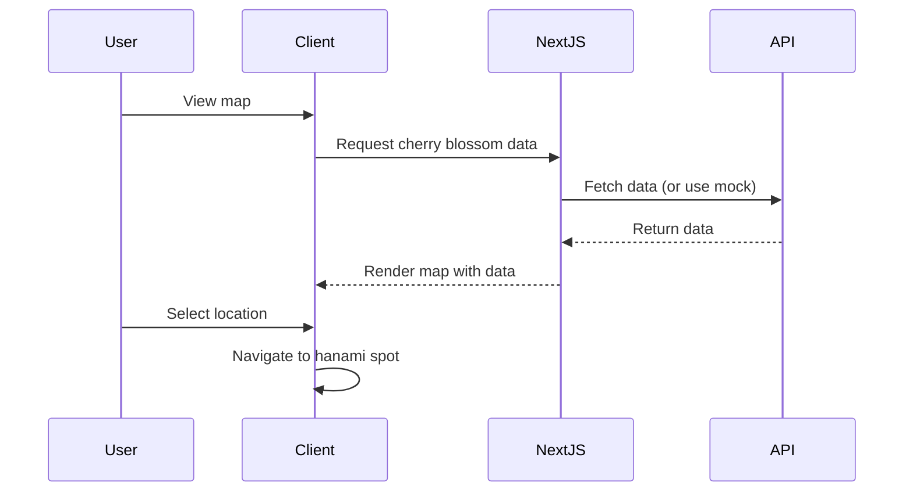
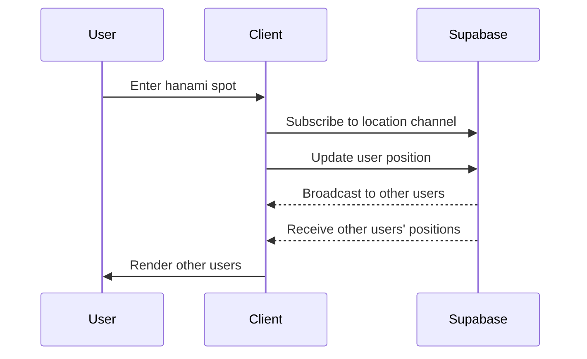

# System Patterns: Sakura Map

## System Architecture

### Overall Architecture
Sakura Map follows a modern web application architecture with the following key components:

### Frontend Architecture
The frontend follows a component-based architecture using React within Next.js:

### Backend Architecture
The backend leverages Supabase for database, authentication, and real-time functionality:

## Design Patterns

### Frontend Patterns

#### Component Design
- **Atomic Design Methodology**: Organizing components as atoms, molecules, organisms, templates, and pages
- **Container/Presentation Pattern**: Separating data fetching from presentation
- **Compound Components**: Creating cohesive component systems with shared state

#### State Management
- **Context API + Hooks**: For global state management
- **React Query**: For server state management and data fetching
- **Local Component State**: For UI-specific state

#### Rendering Patterns
- **Server Components**: For static and database-driven content
- **Client Components**: For interactive elements
- **Incremental Static Regeneration**: For map data that changes infrequently

### Backend Patterns

#### Data Access Patterns
- **Repository Pattern**: Abstracting database access
- **Row-Level Security**: Implementing security at the database level
- **Optimistic Concurrency Control**: For handling concurrent updates

#### Real-time Patterns
- **Pub/Sub Model**: For real-time user position updates
- **Presence Indicators**: For showing active users in a location
- **Broadcast Channels**: For location-specific events

## Key Technical Decisions

### Next.js App Router
Using Next.js App Router for:
- File-based routing
- Nested layouts
- Server components
- Data fetching optimizations

### Supabase Integration
- **Authentication**: Anonymous sessions with local storage
- **Database**: PostgreSQL for structured data
- **Realtime**: For user presence and position updates
- **Edge Functions**: For server-side logic when needed

### Rendering Engine
Evaluating options for the 2D environment:
- **Phaser.js**: Full-featured game engine with physics
- **PixiJS**: High-performance 2D WebGL renderer
- **Three.js**: For potential future 3D enhancements
- **Custom Canvas Implementation**: For lightweight solution

### Map Visualization
Evaluating options for the Japan map:
- **Leaflet.js**: Interactive maps with custom overlays
- **D3.js**: Data-driven visualizations with geographic projections
- **MapLibre GL JS**: Open-source maps with customizable styles

## Component Structure

### Core Components
- **AvatarSelector**: Avatar selection and customization
- **JapanMap**: Interactive map showing cherry blossom status
- **HanamiSpot**: Virtual environment for a specific location
- **Character**: User-controlled avatar with movement
- **OtherUsers**: Representation of other users in the same location
- **EnvironmentObjects**: Cherry trees, stalls, and other elements

### Layout Components
- **MainLayout**: Base layout with common elements
- **MapLayout**: Layout for the map view
- **SpotLayout**: Layout for the hanami spot view

### UI Components
- **Button**: Reusable button component
- **Modal**: For dialogs and notifications
- **Tooltip**: For additional information
- **LoadingIndicator**: For loading states
- **ErrorBoundary**: For graceful error handling

## Data Flow

### User Authentication Flow

### Map Interaction Flow

### Real-time User Presence Flow

## Error Handling Strategy
- **Client-side Validation**: Prevent invalid inputs
- **Graceful Degradation**: Fallbacks for unavailable features
- **Error Boundaries**: Contain errors within components
- **Retry Mechanisms**: For transient network failures
- **Offline Support**: Basic functionality without connection

## Performance Optimization Strategy
- **Code Splitting**: Load only necessary code
- **Image Optimization**: Next.js image optimization
- **Lazy Loading**: For non-critical components
- **Memoization**: Prevent unnecessary re-renders
- **Efficient Real-time Updates**: Throttling position updates
